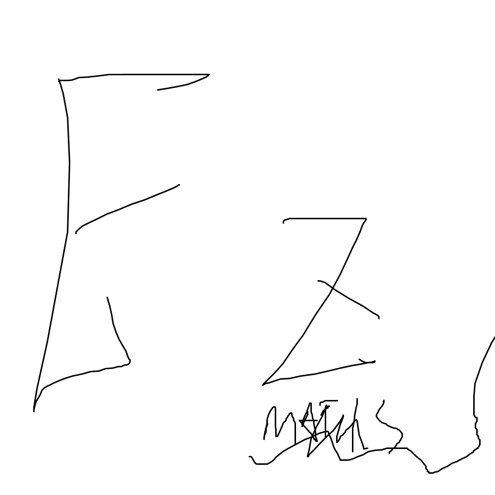

汉语

##

EZMATHS 是一个旨在利用 KaTeX 而成的简单快捷的数学文本编辑器。

# 使用方法
EZMATHS是一个Web软件,你可以直接打开源码中的index.html文件。它可以保存打开及编辑专属于它的文档.ezdf文件。

# 利用的其他开源项目

[KaTex](https://katex.org)

JS与CSS代码
https://cdnjs.cloudflare.com/ajax/libs/KaTeX/0.16.6/katex.min.css
https://cdnjs.cloudflare.com/ajax/libs/KaTeX/0.16.6/katex.min.js

[LaTex公式排版](https://www.latex-project.org/)
